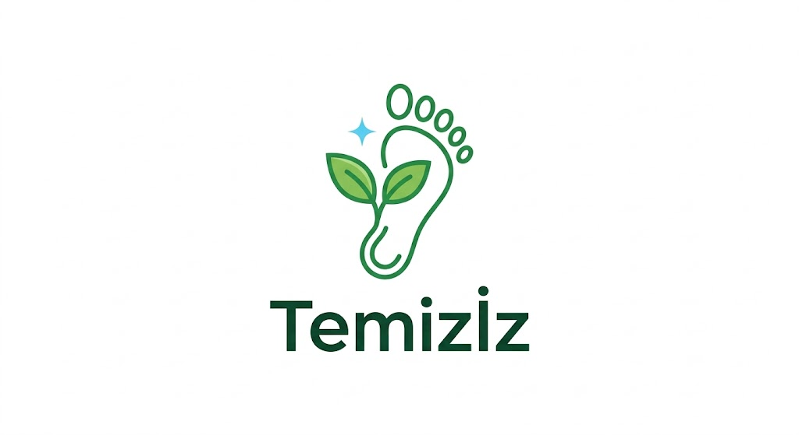

# Temizİz

  

Kullanıcıların çevre kirliliği olan yerleri fotoğraflayıp, temizledikten sonraki hallerini yükleyerek puan kazandıkları, doğa temizliğini teşvik eden oyunlaştırılmış bir sosyal sorumluluk platformudur.

**Proje Kategorisi:** Sosyal Sorumluluk, Çevre, Oyunlaştırma, Web Uygulaması  
**Referans Uygulama:** -  
**Uygulama Adresi:** -  
**Grup Adı:** Nature Lovers

**Proje Ekibi:**
* Ahmet Kağan Karababa  
* Tuğçe Ak

## Proje Dokümanları
* [Ahmet Kağan Karababa - Gereksinim Analizi](Ahmet-Kagan-Karababa/Ahmet-Kagan-Karababa-Gereksinimler.md)
* [Tuğçe Ak - Gereksinim Analizi](Tugce-Ak/Tugce-Ak-Gereksinimler.md)
* [Durum Diyagramı](#) *(İleriki ödevlerde eklenecek)*
* [Durum Senaryoları](#) *(İleriki ödevlerde eklenecek)*
* [Front-End](#) *(İleriki ödevlerde eklenecek)*
* [Back-End](#) *(İleriki ödevlerde eklenecek)*