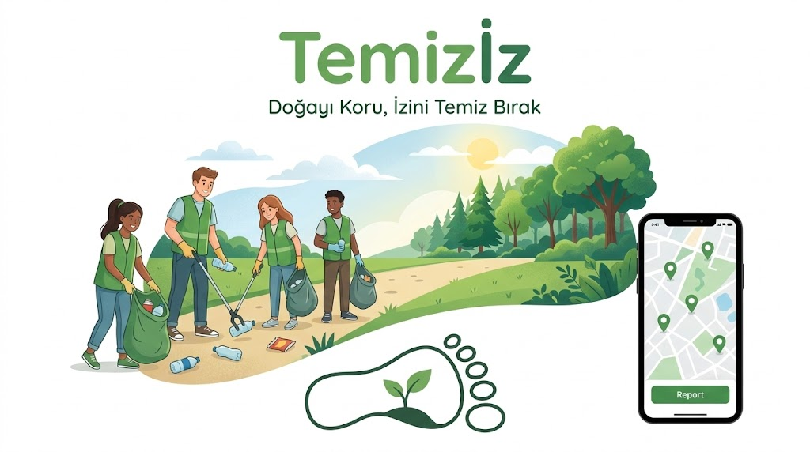

# Temizİz

  <h1>Temizİz - Doğayı Koru, İzini Temiz Bırak</h1>
   
  

---

## 🌍 Proje Hakkında
**Temizİz**, doğa severleri ve çevre bilincine sahip bireyleri bir araya getiren interaktif bir çevre temizliği ve farkındalık platformudur. Kullanıcılar doğada karşılaştıkları kirli alanları harita üzerinde bildirerek diğer kullanıcıların görmesini sağlar, temizlik görevleri oluşturur ve temizlenen alanların öncesi/sonrası fotoğraflarını paylaşarak puan kazanırlar. Instagram keşfet benzeri bir akışla, before/after fotoğraflar toplulukla paylaşılır, beğeni ve yorum ile etkileşim sağlanır. Amacımız, teknolojiyi kullanarak daha temiz bir dünya için topluluk bilinci oluşturmaktır.

## 🚀 Temel Özellikler
* **Kirlilik Bildirimi:** Doğadaki kirli alanları fotoğraflı ve konumlu olarak sisteme ekleme.
* **Temizlik Kanıtı:** Temizlenen alanların son halini yükleyerek görev tamamlama.
* **Before/After Feed:** Instagram keşfet tarzı akışta önce/sonra fotoğraf gösterimi.
* **Beğeni & Yorum:** Temizlik gönderilerine beğeni atma ve yorum yapma.
* **Liderlik Tablosu:** Toplam beğeni sayısına göre kullanıcı sıralaması.
* **Topluluk Etkileşimi:** Temizlenen alanlara yorum yapma ve tebrik mesajları bırakma.

## 🛠️ Kullanılan Teknolojiler
* **Frontend:** React (Vite), JavaScript, CSS
* **Backend:** Node.js, Express
* **Veritabanı:** MongoDB (Atlas)
* **Authentication:** JWT (JSON Web Token)
* **Deployment:** Vercel

## 📄 Proje Dokümanları
* 📋 [Gereksinim Analizi](Gereksinim-Analizi.md)
* 🔌 [REST API Görev Dağılımı](REST-API.md)
* 🖥️ [Web Frontend Görev Dağılımı](WebFrontEnd.md)
* 📐 [API Tasarımı](API-Tasarimi.md)
* 📄 [OpenAPI Spec (YAML)](temiziz.yaml)
* 🎬 [Sunum](Sunum.md)

## 👥 Takım Üyeleri
Bu proje aşağıdaki takım üyeleri tarafından geliştirilmektedir:
* **Ahmet Kağan Karababa** - [GitHub Profili](https://github.com/kagankarababa)
* **Tuğçe Ak**

---
*Bu proje Yazılım Mühendisliği dersi kapsamında geliştirilmektedir.*